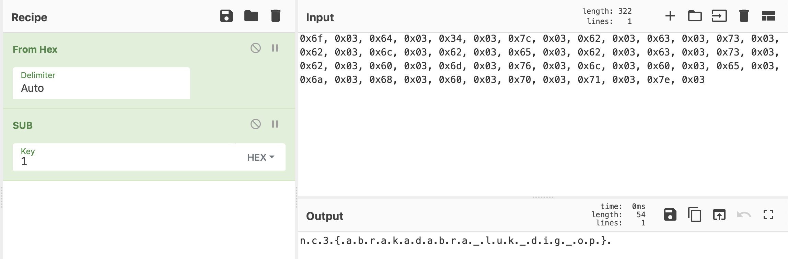

## B2R - Mellemnisse
<hr>

Filen "nisseadgang.elf" downloades, og er en ELF fil, dvs. et program til Linux.

For nogle år siden ville denne opgave nok blive regnet for en smule svær, men da Ghidra kom ud og inkluderede en decompiler, så ændrede det sig. Vi tænkte derfor at deltagerne ville bruge Ghidra, som jo nærmest viser C koden.

Man starter med "main" og ser hurtigt at der kaldes en funktion, der hedder:

```C
/* ErKodeordKorrekt(char const*) */

undefined8 ErKodeordKorrekt(char *param_1)

{
  size_t sVar1;
  undefined8 uVar2;
  byte local_9;
  
  sVar1 = strlen(param_1);
  if (sVar1 == 0x1b) {
    local_9 = 0;
    while (local_9 < 0x1b) {
      if ((char)(param_1[local_9] + '\x01') != g_flagEncrypted[(int)((uint)local_9 * 2)]) {
        return 0;
      }
      local_9 = local_9 + 1;
    }
    uVar2 = 1;
  }
  else {
    uVar2 = 0;
  }
  return uVar2;
}
```

For fornøjelsens skyld, vises her den rigtige kildekode:

```C
static const uint8_t g_flagEncrypted[] = {0x6f, 0x3, 0x64, 0x3, 0x34, 0x3, 0x7c, 0x3, 0x62, 0x3, 0x63, 0x3, 0x73, 0x3, 0x62, 0x3, 0x6c, 0x3, 0x62, 0x3, 0x65, 0x3, 0x62, 0x3, 0x63, 0x3, 0x73, 0x3, 0x62, 0x3, 0x60, 0x3, 0x6d, 0x3, 0x76, 0x3, 0x6c, 0x3, 0x60, 0x3, 0x65, 0x3, 0x6a, 0x3, 0x68, 0x3, 0x60, 0x3, 0x70, 0x3, 0x71, 0x3, 0x7e, 0x3};

bool ErKodeordKorrekt(const char* pText)
{
	const uint8_t C_STRING_LENGTH_TO_CHECK = sizeof(g_flagEncrypted) / 2;
	if (strlen(pText) != C_STRING_LENGTH_TO_CHECK)
	{
		return false;
	}

	for (uint8_t i = 0; i < C_STRING_LENGTH_TO_CHECK; i++)
	{
		const uint8_t currentEncodedInput = pText[i] + 1;
		if (g_flagEncrypted[i * 2] != currentEncodedInput)
		{
			return false;
		}
	}

	return true;
}
```

Pointen er at hvert tegn i input bliver inkrementeret med 1, og tjekket mod en check-array ("g_flagEncrypted"). Det er simpelt nok. Men for at gøre det en lille smule sværre, så skal hver anden byte springes over i check-arrayen. Det ses ved at hver anden byte er 0x03.

Men ovenstående kan nemt dekodes med et script:

```python
g_flagEncrypted = [0x6f, 0x3, 0x64, 0x3, 0x34, 0x3, 0x7c, 0x3, 0x62, 0x3, 0x63, 0x3, 0x73, 0x3, 0x62, 0x3, 0x6c, 0x3, 0x62, 0x3, 0x65, 0x3, 0x62, 0x3, 0x63, 0x3, 0x73, 0x3, 0x62, 0x3, 0x60, 0x3, 0x6d, 0x3, 0x76, 0x3, 0x6c, 0x3, 0x60, 0x3, 0x65, 0x3, 0x6a, 0x3, 0x68, 0x3, 0x60, 0x3, 0x70, 0x3, 0x71, 0x3, 0x7e, 0x3]
r = ''
for c in g_flagEncrypted :
    if c != 0x3 :
        r += chr(c - 1)
print(r)
```


Eller med Cyber Chef:

<details>
<summary>Spoiler alert - Flaget til mellemnisse:</summary>



nc3{abrakadabra_luk_dig_op}

</details>
