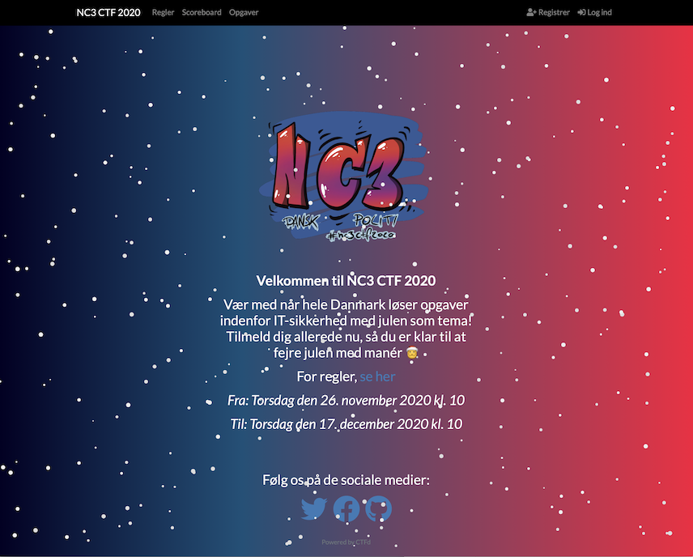
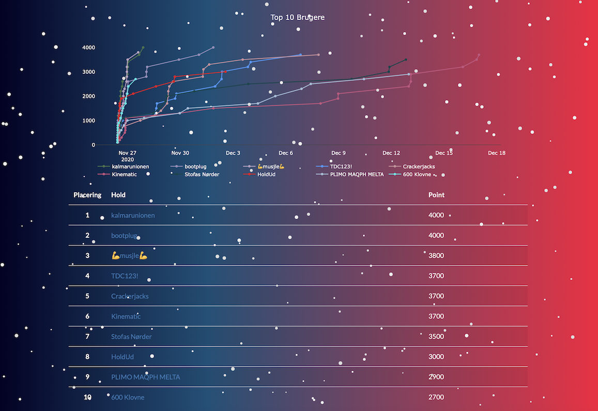

# #NC3CTF2020

NC3 har afholdt en [CTF](https://en.wikipedia.org/wiki/Capture_the_flag) siden 2017. I år fra 27. november til 17. december 2020. Dette gøres for at sætte fokus på IT-sikkerhed, og især gøre flere unge interesserede i en evt. karriere indenfor denne branche.

En CTF kan kort beskrives som en hackerkonkurrence, hvor det handler om at bryde forskellige sikkerhedsforanstaltninger. Målet med hver opgave er at finde et "flag", dvs. en tekst, som opgaven prøvede at holde hemmelig.

I 2020 ændrede vi konceptet på flere punkter:

* Skiftede fra en TOR Hidden Service, dvs. .ONION til vores eget .DK domæne. Dette gør forhåbelig konkurrencen mere tilgængelig for endnu flere.

* Endnu mere fokus på at gøre konkurrencen begynder-venlig, uden at glemme dem, der elsker større udfordringer.

* Vi inddelte opgaverne efter sværhedsgrad i stedet for kategori. Dette også for at imødegå flere begyndere.

* Opgaverne kom alle ud på én gang. Dette ændrer sig dog højst sandsynligt i fremtiden.

* Vores [Boot 2 Root](https://ctfguide.tylerbutler.io/types/categories) blev i år hostet på tryhackme.com

* Officielle writeups til **alle** opgaverne.

**Flag format:** nc3{flag} / Case Insensitive

**URL:** https://www.nc3ctf.dk

&nbsp;
&nbsp;
&nbsp;

# Resultat

Der var spænding fra begyndelsen da to hold lå meget tæt. Men efter et par dage, var alle opgaver løst, og vinderen blev derfor ["kalmarunionen"](https://twitter.com/kalmarunionendm). Nu gjalt det mere for de øvrige hold om at få fuld point på den afsatte tid.

Hele dage og sene nattetimer blev taget i brug når de mere end 1300 deltagere løste opgaver. Det var fedt at se for os, der stod bag konkurrencen. Hvis vi skal sige noget overordnet om konkurrencen, så er det at vi har prøvet at skabe nogle opgaver som vi selv ville have lyst til at løse. Tak til alle for opbakningen og glædelig jul!

#jul_th3_w0r1d_2o20 #nc3ctf2020

&nbsp;
&nbsp;
&nbsp;
&nbsp;

# Writeups

Konceptet omkring writeups er enkelt: En gennemgang af hvordan en opgave kan løses.

Især i [infosec](https://en.wikipedia.org/wiki/Information_security) community'et er der en positiv tendens til at skrive writeups efter en endt CTF. Dette giver jo andre en mulighed for at se hvordan en opgave kunne løses. Hvis man f.eks. selv ikke kunne få hul på en given opgave under konkurrencen, er det derfor yderst interessant at se efterfølgende hvad man kunne have gjort. Ligeledes kunne det være at man allerede havde løst en given opgave, men gerne ville have inspiration til evt. andre løsninger.

Herunder følger de officielle writeups, samt dem som er skrevet af community'et. Lav gerne "pull requests" på denne side, hvis du har links til dine egne writeups.

&nbsp;

Hent alle opgaverne i én fil [her](nc3ctf2020_opgaver.7z) (kodeord: nc3).

&nbsp;

# Officielle Writeups

Begynder:

[Introduktion til CTF](Introduktion%20til%20CTF.md)

[Besked fra fronten](Besked%20fra%20fronten.md)

[Hallo, hallo, er der nogen?](Hallo,%20hallo,%20er%20der%20nogen.md)

[Rosettestenen](Rosettestenen.md)

[Julegåden 0](Julegåden%200.md)

Øvet:

[Befibbet](Befibbet.md)

[Kludetæppet](Kludetæppet.md)

[Lorem Ipsum](Lorem%20Ipsum.md)

[Nisse Omvendt](Nisse%20Omvendt.md)

[B2R - Lillenisse](B2R%20-%20Lillenisse.md)

[B2R - Mellemnisse](B2R%20-%20Mellemnisse.md)

[B2R - Storenisse](B2R%20-%20Storenisse.md)

[Julegåden 1](Julegåden%201.md)

[Julegåden 4](Julegåden%204.md)

[Dllosaurus](DLLosaurus.md)

Svær:

[Brødristeren](Brødristeren.md)

[B2R - Root](B2R%20-%20Root.md)

[Julegåden 2](Julegåden%202.md)

[Julegåden 3](Julegåden%203.md)

[Den Røde Tråd II](Den%20Røde%20Tråd%20II.md)

&nbsp;

# Community Writeups:

Skriv og lær fra dig! Vi modtager meget gerne [pull requests](https://docs.github.com/en/free-pro-team@latest/github/collaborating-with-issues-and-pull-requests/about-pull-requests).
